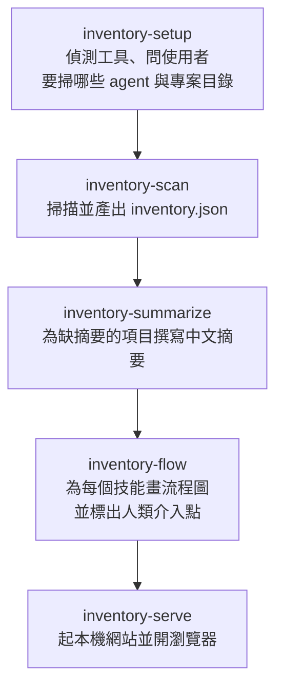

# /inventory — 總入口

你是操作者。整個流程由你（AI agent）執行，使用者只需要回答幾個問題。

## 開始前先畫流程圖

先用 Mermaid 向使用者說明接下來會做的五步，並標出會停下來問人的地方：setup 一定會問；flow 只在待補流程圖很多時問一次要全畫還是只畫常用的：



## 取得 $REPO

先取得 `$REPO`（agent-inventory 的 clone 目錄）。所有指令與 `data/` 路徑都用它當前綴，從任何目錄執行都可以，不需要 cd：

```bash
REPO="$(python3 -c 'import json,os;p=os.path.expanduser(os.environ.get("AGENT_INVENTORY_CONFIG","~/.config/agent-inventory/config.json"));print(json.load(open(p)).get("repoRoot","") if os.path.isfile(p) else "")')"; [ -z "$REPO" ] && [ -f bin/scan.py ] && REPO="$PWD"; echo "REPO=$REPO"
```

印出空白代表兩邊都找不到：問使用者 clone 放在哪，之後由 `inventory-setup` 寫進設定檔的 `repoRoot`。

## 執行順序

1. 檢查 `~/.config/agent-inventory/config.json` 是否存在**且含 `projectRoots`**（只有 `repoRoot` 的設定檔是安裝器留的，還沒設定）。
   - 不存在、沒有 `projectRoots`，或使用者說要重新設定 → 執行 `inventory-setup` 技能（會問使用者問題）。
   - 有 → 直接進下一步，並簡短告知目前設定的專案根目錄。
2. 執行 `inventory-scan` 技能。
3. 若掃描結果的「待補摘要」大於 0 → 執行 `inventory-summarize` 技能。
4. 若掃描結果的「待補流程圖」大於 0 → 執行 `inventory-flow` 技能。數量很多時先問使用者要全部畫還是只畫常用的技能。
5. 執行 `inventory-serve` 技能。
6. 回報：各工具四分類的數量、跨工具共用的數量、有流程圖的技能數、網址。

## 原則

- 所有腳本都在 agent-inventory clone 的 `bin/` 底下，用 `python3` 執行，不需要安裝任何套件（Python 3.9 以上）。
- 技能可能被複製或 symlink 到全域技能目錄，所以**不要假設目前目錄就是 repo**。每個技能開頭都先取得 `$REPO`，再用 `"$REPO/bin/…"` 與 `"$REPO/data/…"` 的絕對路徑；腳本以自身位置定位 `data/`，從哪裡執行結果都一樣。
- 資料只寫進 clone 的 `data/`（已在 .gitignore），不會離開這台電腦；你在寫摘要時讀到的檔案內容也不要貼回對話。
- 不要修改使用者的任何規則檔或技能檔，這個流程只讀不寫。
