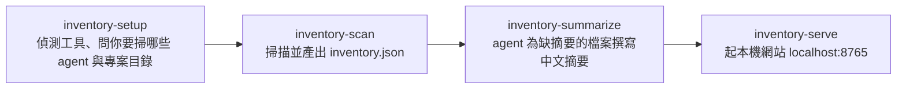

# agent-inventory

盤點你這台電腦上所有 AI coding agent 的**全域規則、全域技能、專案規則、專案技能**，由你自己的 AI agent 全程操作，最後用一個米白色、乾淨的本機網站呈現，每條規則、每個技能都有一段中文摘要。

支援六個工具：**Claude Code、Codex（ChatGPT 桌面 App／CLI）、Google Antigravity、Cursor、OpenClaw、Hermes Agent**。

> 全程本機。掃描結果與摘要只寫進 `data/`（已在 `.gitignore`），不會上傳任何東西。

## 怎麼用

1. Clone 這個 repo。
2. 在 repo 目錄開你的 AI agent（Claude Code、Codex、Antigravity、Cursor 任一）。
3. 對它說：

   ```
   /inventory
   ```

   或用白話：「幫我盤點這台電腦的 AI agent 規則與技能」。

agent 會依 `.agents/skills/` 裡的技能鏈自己做完四步，只會在第一步問你兩個問題（用哪些 agent、掃哪些資料夾）：



需求只有 **Python 3.9 以上**，不用安裝任何套件。

### 不透過 agent，自己跑

```bash
python3 bin/detect.py                          # 看看偵測到哪些工具、候選專案根目錄
python3 bin/scan.py --roots "~/Developer"      # 掃描（或先寫好 ~/.config/agent-inventory/config.json）
python3 bin/serve.py                           # 開網站
```

沒有 agent 幫你寫摘要時，所有項目都會顯示「尚未撰寫摘要」，只有技能會另外顯示作者原本的 `description`。摘要一律由 agent 用設定語言（預設繁體中文）重新詮釋，不直接沿用原文。

## 六個工具讀哪些檔

「全域」是使用者層；「專案」是掃描根目錄底下每個含規則或技能的資料夾。

| 工具 | 全域規則 | 全域技能 | 專案規則 | 專案技能 |
| :-- | :-- | :-- | :-- | :-- |
| Claude Code | `~/.claude/CLAUDE.md`、`~/.claude/rules/`、`~/.claude/output-styles/` | `~/.claude/skills/`、`~/.claude/plugins/`（標 plugin） | `CLAUDE.md`、`CLAUDE.local.md`、`.claude/rules/*.md` | `.claude/skills/` |
| Codex | `~/.codex/AGENTS.md` | `~/.codex/skills/`、`~/.agents/skills/`、`~/.codex/skills/.system/`（標 builtin） | `AGENTS.md` | `.agents/skills/`、`.codex/skills/` |
| Google Antigravity | `~/.gemini/GEMINI.md`、`~/.gemini/antigravity/global_rules/`、`global_workflows/` | `~/.gemini/antigravity/skills/` | `GEMINI.md`、`.agent/rules/*.md`、`.agent/workflows/*.md` | `.agent/skills/` |
| Cursor | User Rules 存在 App 設定，不是檔案（網站會提示）；`~/.cursor/rules/*.mdc` | `~/.cursor/skills/`、`~/.agents/skills/`；相容讀 `~/.claude/skills/`、`~/.codex/skills/` | `.cursor/rules/**/*.mdc`、`AGENTS.md`、`.cursorrules` | `.cursor/skills/`、`.agents/skills/`；相容讀 `.claude/skills/`、`.codex/skills/` |
| OpenClaw | 預設 workspace（`~/.openclaw/workspace/`）的 `AGENTS.md`、`SOUL.md`、`TOOLS.md`、`USER.md`、`IDENTITY.md`、`HEARTBEAT.md`、`BOOT.md`、`MEMORY.md` | `<workspace>/skills/`、`<workspace>/.agents/skills/`、`~/.agents/skills/`、`~/.openclaw/skills/` | 其他 agent 的 workspace 各算一個「專案」 | 同上 |
| Hermes Agent | `~/.hermes/SOUL.md`、`~/.hermes/AGENTS.md` | `~/.hermes/skills/`（兩層巢狀） | 目前目錄第一個命中：`.hermes.md` → `AGENTS.md` → `CLAUDE.md` → `.cursorrules` | 無 |

幾件掃描時會自動處理的事：

- **跨工具共用**：同一個檔案被多個工具讀到（symlink、`~/.agents/skills` 這類共用目錄），只算一個項目，網站上標「共用於 ×N」。
- **引用檔**：只寫 `@AGENTS.md` 的 `CLAUDE.md` 自動判定為引用，不另寫摘要。
- **摘要快取**：`data/summary-cache.json` 以內容 hash 為 key，檔案沒改就不重寫。
- **專案摘要**：每個專案除了列出規則與技能，還有一段說明專案目的的摘要，取材自該資料夾的 README 與規則檔。
- **開檔**：卡片抽屜可用系統內建文字編輯器（macOS 的「文字編輯」、Windows 的記事本）、Finder 或檔案總管、VS Code、Cursor 開啟該檔，由 `bin/serve.py` 的 `/api/open` 端點在本機執行，只接受 inventory 裡列出的檔案。
- **未安裝的工具**：仍會列出它「如果安裝了」會讀到的共用目錄內容，網站上灰掉並標「未偵測到」。

Cursor 與 OpenClaw 的路徑來自官方文件（[Cursor Rules](https://cursor.com/docs/context/rules)、[Cursor Skills](https://cursor.com/docs/context/skills)、[OpenClaw Skills](https://docs.openclaw.ai/tools/skills)、[OpenClaw Agent workspace](https://docs.openclaw.ai/concepts/agent-workspace)），尚未在真機驗證，歡迎回報。

## 專案結構

```text
.agents/skills/          五個技能（inventory、inventory-setup、-scan、-summarize、-serve）
.claude/skills  ->  ../.agents/skills      給 Claude Code
.agent/skills   ->  ../.agents/skills      給 Antigravity
bin/detect.py            偵測已安裝工具與候選專案根目錄
bin/scan.py              掃描 → data/inventory.json、data/pending-summaries.json
bin/merge.py             把 agent 寫的摘要合併進 inventory 與快取
bin/serve.py             本機 http.server
adapters/                每個工具一個檔，宣告它讀哪些路徑；要支援新工具就加一個檔
site/                    原生 HTML／CSS／JS，無打包
data/                    掃描產物（.gitignore）
install.sh               選用：把技能 symlink 到各工具的全域技能目錄，讓 /inventory 在任何目錄都能用
```

設定檔在 `~/.config/agent-inventory/config.json`，repo 內不含任何個人路徑。

## 新增一個工具

在 `adapters/` 加一個檔，照 `adapters/base.py` 開頭的規格宣告 `SPEC`，再在 `adapters/__init__.py` 註冊。一般不需要動 `scan.py`。

## 隱私

- 掃描只讀檔，不改任何規則或技能。
- agent 寫摘要時會讀規則全文；摘要規格明確要求不得寫入密碼、token、帳號等敏感字串。
- 網站只在 `127.0.0.1` 上服務。

## 授權

MIT License，見 `LICENSE`。
